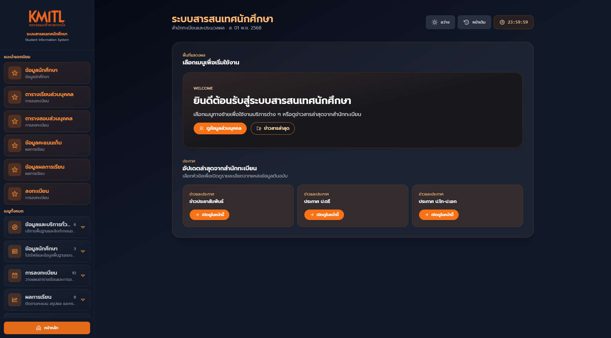

# 📦 KMITLX Extension Chrome

> Transform KMITL Student Information System UI/UX with enhanced features for a better experience.

 <table>
        <tr>
            <td>
                
                <p align="center">
                    Preview in dark mode
                </p>
            </td>
            <td>
                
                <p align="center">
                    Preview in light mode
                </p>
            </td>
        </tr>
    </table>
    
## 🔮 Features

-   [Svelte](https://svelte.dev/)
-   [TypeScript](https://www.typescriptlang.org/)
-   [Vite](https://vitejs.dev/)
-   [CRXJS Vite Plugin](https://github.com/crxjs/chrome-extension-tools/blob/main/packages/vite-plugin/README.md)
-   [Chrome Extensions Manifest V3](https://developer.chrome.com/docs/extensions/mv3/intro/)
-   [Tailwind CSS](https://tailwindcss.com/)

## 🚜 Development

```bash
# install dependencies
yarn install

# start dev with HMR (Chrome)
yarn dev

# or start dev for Firefox
yarn dev:firefox
```

The extension is built with [WXT](https://wxt.dev). Output goes to `.output/<target>`.

## ⚙️ Build

```bash
# build for Chrome and Opera (Chromium)
yarn build
yarn build:opera

# build for Firefox
yarn build:firefox

# create store-ready zips in `.output/`
yarn zip
yarn zip:firefox
yarn zip:opera
```

## 📦 Load unpacked extensions

1. Chrome or Opera: open `chrome://extensions`, enable Developer mode, click `LOAD UNPACKED`, and select `.output/chrome-mv3`.
2. Firefox: open `about:debugging`, choose `This Firefox`, click `Load Temporary Add-on`, and select any file inside `.output/firefox-mv2`.

## ✅ Checks

```bash
yarn check   # svelte-check types
yarn lint    # eslint
yarn test    # vitest
```

## 🤝 Contribute
we invite you to contribute kmitlx

- you can open pull request to this repo we will review your code and approve 😎

## 🫡 credit
> [Svelte Typescript Chrome Extension Boilerplate](https://github.com/NekitCorp/chrome-extension-svelte-typescript-boilerplate)